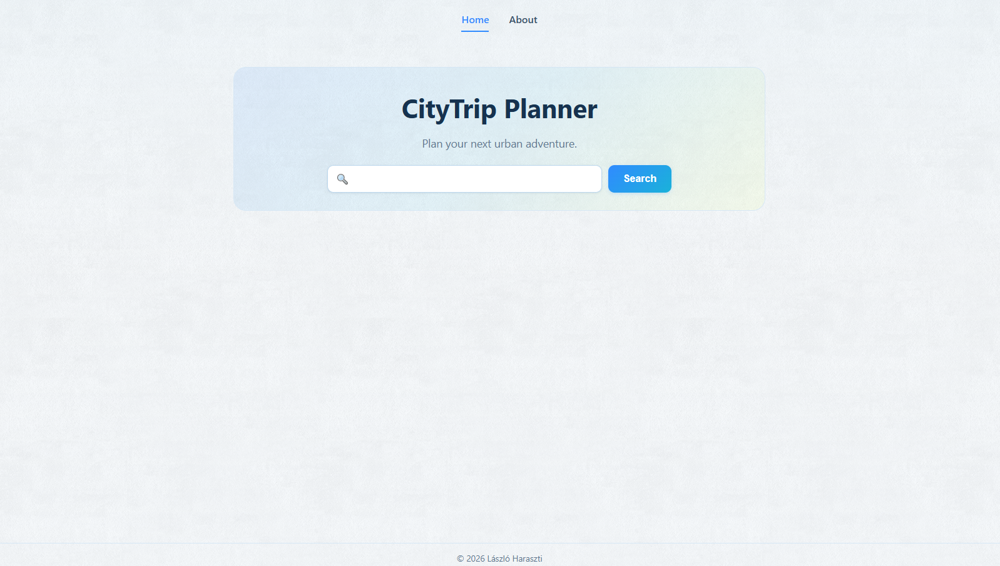
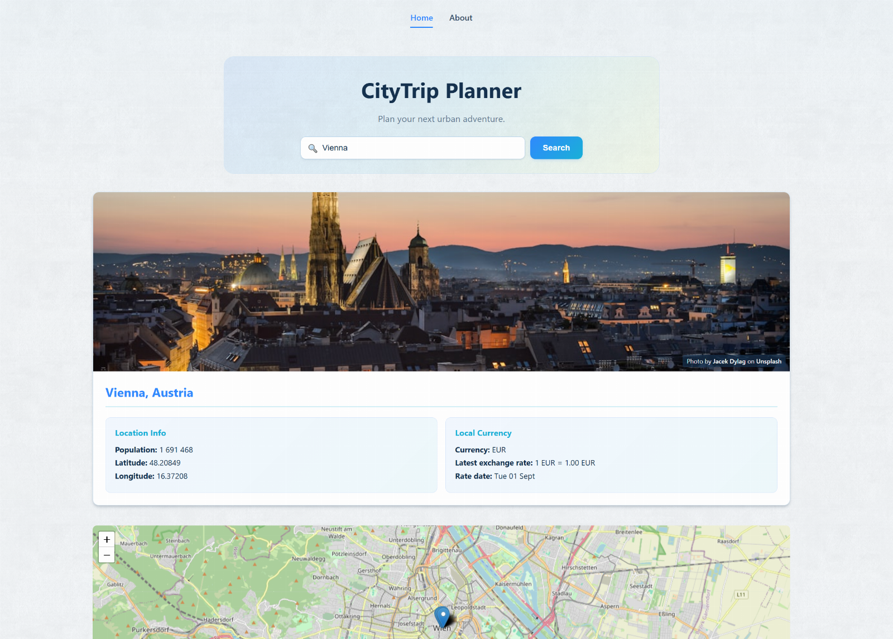
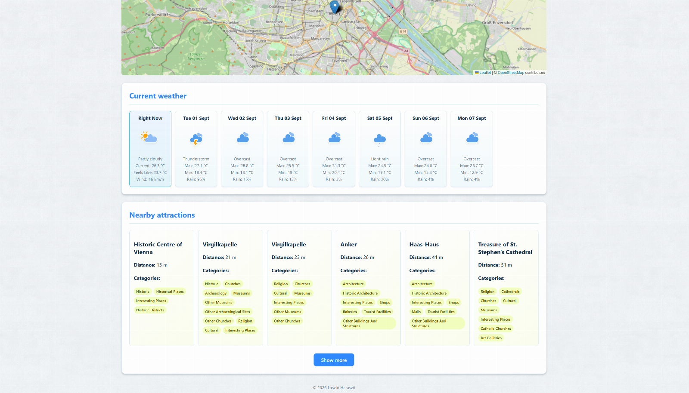

# CityTrip Planner

This README is available in English and German.  
Diese README-Datei ist auf Englisch und Deutsch verfügbar.

CityTrip Planner is a full-stack web application for discovering useful information about destinations for short city trips.

---

## English

### Overview

CityTrip Planner helps users prepare for short city breaks by combining information from multiple external APIs in one application.

Users can search for a city, choose from several matching locations, and view weather information, local currency exchange rates, nearby attractions, destination images, and an interactive map.


### Screenshots

#### Home and search



#### Destination details



#### Weather and nearby attractions



### Features

- Search for cities
- Selection from multiple geocoding results
- Basic city information
- Current weather data
- Seven-day weather forecast
- Local currency and exchange rate
- Destination images
- Nearby attractions
- Interactive map with city and attraction markers
- Progressive display of attractions with a **Show more** button
- Loading and error handling
- Separate error handling for external APIs
- Responsive user interface
- About page in English and German
- Custom 404 page

### Technologies

#### Frontend

- React
- JavaScript
- Vite
- React Router
- React Leaflet
- Leaflet
- HTML5
- CSS3

#### Backend

- Node.js
- Express
- REST API
- Environment variables
- Asynchronous API requests
- CORS configuration

### External Services

- Open-Meteo – geocoding and weather data
- OpenTripMap – nearby attractions
- Unsplash – destination images
- Frankfurter – currency exchange rates
- OpenStreetMap – map tiles

### Project Goal

The goal of this project was to develop a useful city trip planning application while practising the integration of multiple external APIs.

The project focuses on asynchronous data fetching, processing JSON responses, combining information from different providers, handling external API errors, and displaying the results in a responsive React interface.

### Error Handling

External APIs may occasionally be unavailable or reach their request limits.

The application handles these errors separately, allowing the remaining destination information to stay available whenever possible instead of causing the entire request to fail.

---

## Deutsch

### Überblick

CityTrip Planner unterstützt Nutzerinnen und Nutzer bei der Vorbereitung kurzer Städtereisen, indem Informationen aus mehreren externen APIs in einer Anwendung zusammengeführt werden.

Es kann nach einer Stadt gesucht und zwischen mehreren passenden Treffern gewählt werden. Anschließend zeigt die Anwendung Wetterinformationen, lokale Wechselkurse, Sehenswürdigkeiten in der Nähe, Bilder des Reiseziels und eine interaktive Karte an.

### Funktionen

- Suche nach Städten
- Auswahl aus mehreren Geocoding-Ergebnissen
- Grundlegende Stadtinformationen
- Aktuelle Wetterdaten
- Sieben-Tage-Wettervorhersage
- Lokale Währung und Wechselkurs
- Bilder der Reiseziele
- Sehenswürdigkeiten in der Nähe
- Interaktive Karte mit Stadt- und Sehenswürdigkeitsmarkern
- Schrittweise Anzeige weiterer Sehenswürdigkeiten mit einer **Show more**-Schaltfläche
- Lade- und Fehlerbehandlung
- Separate Behandlung von Fehlern externer APIs
- Responsive Benutzeroberfläche
- About-Seite auf Englisch und Deutsch
- Eigene 404-Seite

### Verwendete Technologien

#### Frontend

- React
- JavaScript
- Vite
- React Router
- React Leaflet
- Leaflet
- HTML5
- CSS3

#### Backend

- Node.js
- Express
- REST API
- Umgebungsvariablen
- Asynchrone API-Anfragen
- CORS-Konfiguration

### Externe Dienste

- Open-Meteo – Geocoding- und Wetterdaten
- OpenTripMap – Sehenswürdigkeiten in der Nähe
- Unsplash – Bilder der Reiseziele
- Frankfurter – Wechselkurse
- OpenStreetMap – Kartendaten

### Projektziel

Ziel dieses Projekts war es, eine praktische Anwendung für die Planung kurzer Städtereisen zu entwickeln und gleichzeitig die Anbindung mehrerer externer APIs zu üben.

Der Schwerpunkt liegt auf asynchronen Datenabfragen, der Verarbeitung von JSON-Antworten, der Zusammenführung verschiedener Datenquellen, der Behandlung von Fehlern externer APIs und der responsiven Darstellung der Ergebnisse in React.

### Fehlerbehandlung

Externe APIs können vorübergehend nicht erreichbar sein oder ihr Anfrage-Limit erreichen.

Die Anwendung behandelt diese Fehler getrennt, sodass die übrigen Informationen über das Reiseziel nach Möglichkeit weiterhin angezeigt werden, anstatt die gesamte Anfrage abzubrechen.

---

## Local Installation / Lokale Installation

Clone the repository / Repository klonen:

```bash
git clone https://github.com/laci528-creator/citytrip-planner-app1.git
cd citytrip-planner-app1
```

Install the dependencies / Abhängigkeiten installieren:

```bash
npm install
npm install --prefix client
npm install --prefix server
```

Create the frontend environment file:

```text
client/.env
```

```env
VITE_API_URL=http://localhost:5000/api
```

Create the backend environment file:

```text
server/.env
```

```env
PORT=5000
CLIENT_URL=http://localhost:5173

OPENTRIPMAP_API_KEY=your_opentripmap_api_key
UNSPLASH_ACCESS_KEY=your_unsplash_access_key
```

Example environment files are included in the repository as `.env.example` files.

Start the frontend and backend development servers:

```bash
npm run dev
```

---

## Deployment

- Frontend: Vercel
- Backend: Render

The Vercel configuration includes an SPA rewrite so React Router routes can also be opened and refreshed directly.

---

## Live Demo

Frontend: https://citytrip-planner-green.vercel.app/

Backend API: https://citytrip-planner-app1.onrender.com

---

## Repository

GitHub: https://github.com/laci528-creator/citytrip-planner-app1